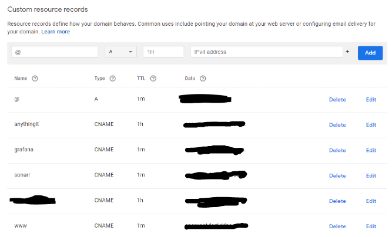
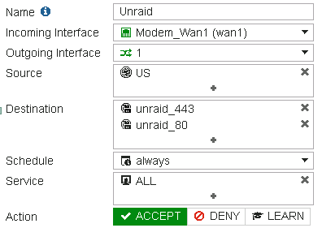
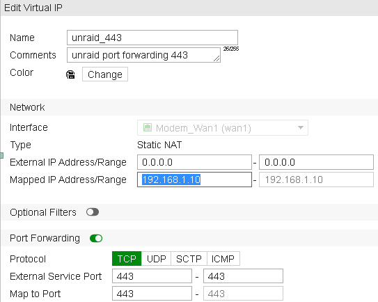
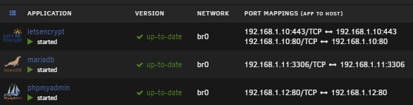
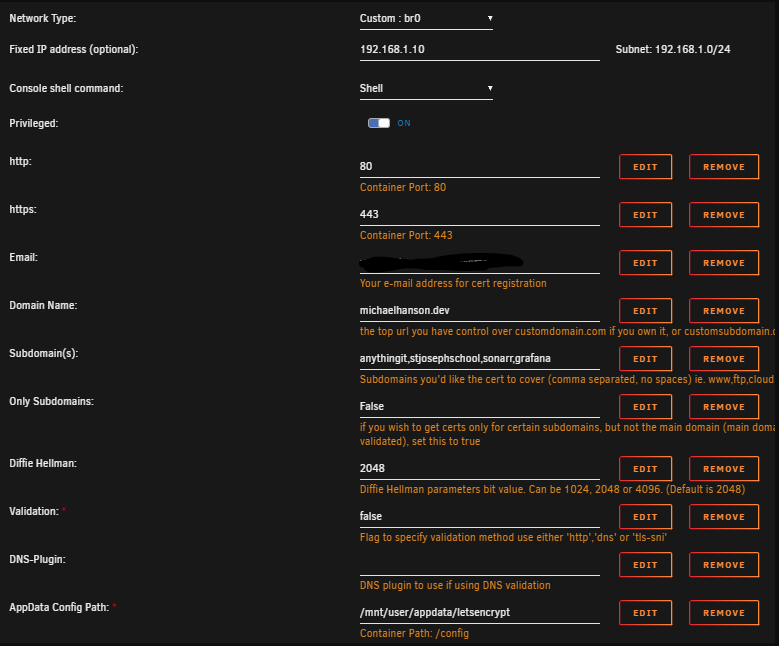
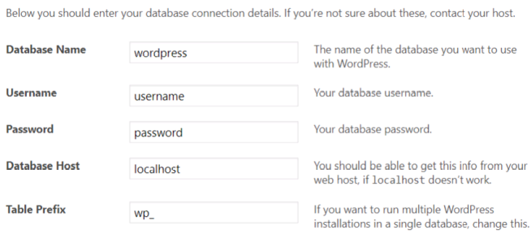

# High overview of how to setup a WordPress site that is hosted through Unraid.

This blog is something for me to look back at as a resource and to possibly help someone like you out. 

## 1\. Domain Names

Make sure you have a domain name and that you have your 'CNAME's created so DNS can propagate. Pro tip, if you can change the TTL to 1 minute to help the propagation happen quicker. Googles default is 1 hour.  (The items crossed out are dynamic dns names for my public IP)

## 2\. Port Forwarding

Here is where you are going to need to configure your firewall or router for port forwarding. In my case I needed to create a new firewall policy to allow 443 and 80 to point to my Unraid server. If you have just a standard router you are going to need to forward 1443 and 180 since Unraid talks over 443 and 80 by default. 

Below, I created two virtual IPs that were used in the policy in the picture above. I created 2 VIPs, one for 443 and one for port 80. 

## 3\. Dockers

Install the following containers. 

- MariaDB 
- LetsEncrypt 
- Phpmyadmin 

Make sure the dockers are on their own custom network. They can not talk to each other if they are on the host network. 

Now we need to create the database for our wordpress site. 

Open a terminal within unraid.

1. docker exec -it MariaDB bash
2. mysql -uroot -p
    1. The password is the default that your configured in your container when you downloaded it from CA. Don;t change your password through the maria docker.
3. Create a new DB inside MariaDB
    1. CREATE USER 'newUser' IDENTIFIED by 'password';
    2. CREATE DATABASE IF NOT EXISTS siteNameDb;
    3. GRANT ALL PRIVILEGES ON siteNameDb.\* TO 'newUser' IDENTIFIED BY 'password';
    4.  Quit
    5. Exit

## 4\. LetsEncrypt

Since we are using a FortiGate FW we can use port 80 and port 443 to talk to our reverse proxy. Below is the configuration for LE. If you have a regular router that you did your port forwarding on, you need to specify the two ports you forwarded in for http/https. 

## 5\. Ngnix

Navigate to the default config

Located on your server here - \\unraidServerappdataletsencryptngnixsite-configdefault

You can view my config here - [LINK](https://pastebin.com/AWNxYWMT)

## 6\. WordPress

1. Download the latest version of wordpress. You can find it here. -> [wordpress.org/download](https://wordpress.org/download/) 
2. Extract and mode the contents under your www folder under LetsEncrypt
    1. \\unraidServerappdataletsencryptngnixwwwdomain
3. From here you can navigate to your domain name in your favorite browser and fill out the WP setup

1. 1. Database name: configured in step 2a
    2. Username: configured in step 2a
    3. Password: configured in step 2a
    4. Database host: this is the MariaDB docker IP and port.
    5. Table Prefix: “wp\_”

## 7\. Other Settings for WordPress

1. 1.    Migrating wp from hosting provider to unraid
        
        1. Backup your current WordPress site using the plugin “all in one wp migration” this creates a database backup as well as all content on the site. Stored in one file
            
        2. Once we get a backup made, we can move over to our new site and install the plugin “all in one wp migration”
            
        3. Navigate to the import area under the plugin and navigate to your backup.wpress file that you took in the first step. If you get an error regarding upload size, see step 6b.
            
    2. Changing upload size for restoring wp site
        
        1. Install the plugin called “all-in-one-wp-migration-file-extension.zip” found here [https://import.wp-migration.com/all-in-one-wp-migration-file-extension.zip](https://import.wp-migration.com/all-in-one-wp-migration-file-extension.zip)
            

## HINTS

1. When you initially configure your WP site you might try and delete some plugins and run into the FTP popup. Add the following to wp-config.php:
    1. `define( 'FS_METHOD', 'direct' );`

## Shout-Outs

HUGE thank you to the following for helping me learn about self hosting and reverse proxies. 

- [SpaceInvader One](https://www.youtube.com/channel/UCZDfnUn74N0WeAPvMqTOrtA)
- [Technicalramblings](https://technicalramblings.com/) - [source](https://technicalramblings.com/blog/how-to-set-up-a-wordpress-site-with-letsencrypt-and-mariadb-on-unraid/) 
- IceMan
