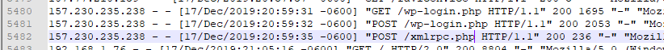

## Notice

Lorem ipsum dolor sit amet, consectetur adipiscing elit. Ut elit tellus, luctus nec ullamcorper mattis, pulvinar dapibus leo.

## 1\. Edit site config

Open appdataletsencryptnginxsite-confdefault up with notepad++ or another text editor. Inside the main server block where you want to block /wp-admin in add the following code block before the try\_files $uri part. 

`client_max_body_size 0;`

`location /wp-admin {  
   allow 192.168.1.0/24;  
   deny all;  
}  
location / {  
   try_files $uri $uri/ /index.php?$args;  
}  
location ~ .php$ {  
   fastcgi_split_path_info ^(.+.php)(/.+)$;  
   fastcgi_pass 127.0.0.1:9000;  
   fastcgi_index index.php;  
   include /etc/nginx/fastcgi_params;  
}  
`

Here we are allowing machines with the IP address of 192.168.1.2 - 192.168.1.254 and denying everyone else.  

## Subdomains

If you have a sub-domain its the same concept just place the same code block under the server.

## Blocking XML-RPC

In the image above you can see this address attempting to post to /xmlrpc.ph

Long story short. XML-RPC isnt really used much anymore and has been known to be exploitable. I believe it is best practice to block the route through Nginx.

There is a wonderful write up on how to exploit it by null-byte - [Link here](https://null-byte.wonderhowto.com/how-to/gain-control-wordpress-by-exploiting-xml-rpc-0174864/)

Under the location /wp-admin block we can add the following.  
`  
location = /xmlrpc.php {  
   deny all;  
   access_log off;  
   log_not_found off;  
   return 444;  
}  
`
