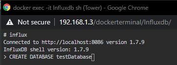

## Create a new database within Influx

Open up influx docker via bash

## Posting to new database

`#!/bin/bash`

`INFLUX_IP="192.168.1.13"`

`INFLUX_PORT="8086"`

`DB_NAME="fail2ban"`

`#db name for where you want your pihole data. path_access=/home/pi/Documents/unraid_appdata/letsencrypt/log/nginx/access.log`

`#unique visitors`

`num_unique_visitors=$(cat $path_access | awk '{print $1}' | sort | uniq | wc -l)` `num_of_site_hits=$(cat $path_access | wc -l)`

`# Load data in influxdb`

`curl -i -XPOST "http://$INFLUX_IP:$INFLUX_PORT/write?db=$DB_NAME" --data-binary 'access``num_unique_visitors='$num_unique_visitors',num_of_site_hits='$num_of_site_hits`

The code of interest here is the last statement where we are posting the data to the url of influx using curl.
